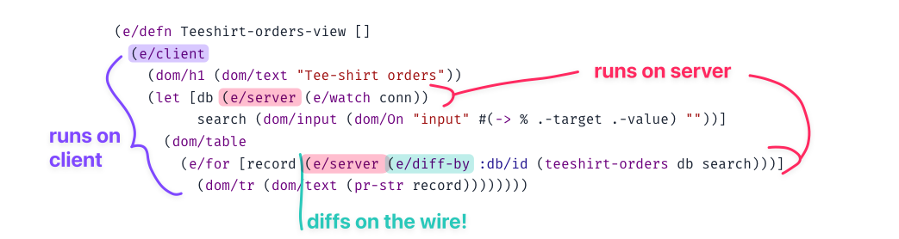
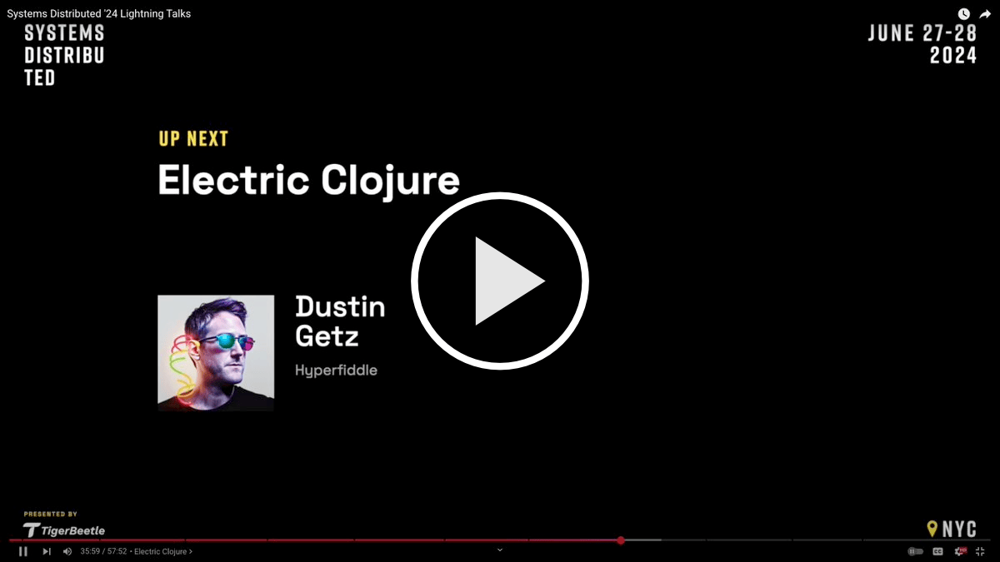

# Electric Clojure – full-stack differential dataflow for UI

`com.hyperfiddle/electric {:mvn/version "v3-alpha-SNAPSHOT"}`

> [!NOTE]
> Electric v3 is now in private beta! Request beta access here: https://www.hyperfiddle.net/early-access.html

Electric is a new way to build rich, interactive web products that simply have too much interactivity, realtime streaming, and too rich network connections to be able to write all the frontend/backend network plumbing by hand. With Electric, you can compose your client and server expressions directly (i.e. in the same function), and the Electric compiler macros will **infer at compile time the implied frontend/backend boundary** and generate the corresponding full-stack app.

*Figure: In Electric, client and server expressions compose directly, and the Electric compiler transparently solves the network boundary through a straightforward dataflow graph analysis.*

**How it works:** Unlike request/response frameworks, frontend ORMs, and client-side databases that suffer from request waterfalls, over/under fetching, large payload deserialization and other performance issues that get worse as your codebase and database grows, Electric uses a **custom Clojure/Script compiler to perform deep graph analysis** of your unified frontend/backend program and automatically determine the implied network cut, and then compile your program into separate reactive client and server target programs that cooperate and anticipate each other's needs. See [UIs are streaming DAGs (Getz 2022)](https://hyperfiddle.notion.site/UIs-are-streaming-DAGs-e181461681a8452bb9c7a9f10f507991) for a quick 10 minute video explainer of how this works and why it **actually doesn't result in the request waterfalls you might expect,** even in the presence of deep nesting, loops and control flow.

- **Fully reactive:** unlike javascript frameworks, in Electric, reactivity is built directly into the programming language itself. Reactive-if, reactive-for, reactive lambda. When everything is reactive, it feels like nothing is reactive. No observables! No async types! De-load your mind and relax.

- **Multi-tier**: frontend and backend are defined in the same expression, same function, same file. It's not code sharing, it's code *splitting*. Let the compiler infer the boundary from your code, instead of contorting your code — nay, your entire architecture — to fit the boundary.

- **Network-transparent**: Electric closures close over server and client scope bindings, all in the same expression. The Electric compiler uses compile-time static knowledge of your source code to slice your expressions into client and server portions. Right through closures, loops and deeply nested function calls.

- **Strong composition:** Network-transparent Electric functions are true functions. You have lambda, recursion, HOFs, closures, dynamic scope, macros, etc: the full undamaged composition power of Lisp. Goodbye "functional core imperative shell"; with Electric the **entire system is a function**.

Our mission is to raise the abstraction ceiling in web development in the same way that managed memory did in the 90s, paving the way for something new.

# Lightning talk – 5 minutes

  

# Docs and getting started
- [Mission statement, product overview, license, community](https://docs.google.com/document/d/1TgExchcIyWd4BH9qwb4vjp7uaBjWyBtPWEkGqSfvlTk/edit?tab=t.0)
- [Tutorial and reference](https://docs.google.com/document/d/1frkb5URGFZUdWyCDl9moGFcPcLuDtW-M-HnCJOHkuDA/edit?tab=t.0#heading=h.m5gkjf7b16l)
- v3 starter app: [request early access here](https://www.hyperfiddle.net/early-access.html)

# License

Electric v3 is free for bootstrappers and non-commercial use, but is otherwise a commercial project, which helps us continue to invest and maintain payroll for a team of 4. See [license change announcement](https://tana.pub/lQwRvGRaQ7hM/electric-v3-license-change).
