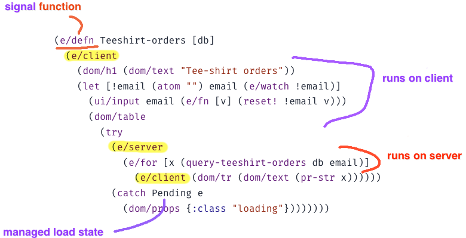

# Electric Clojure – a reactive DSL for full-stack web development, with compiler-managed frontend/backend network sync

Electric Clojure's mission is to empower the world's brightest UX luminaries to express shrewd and nuanced designs, and bring them to life. By framing UI as a high frequency concurrency problem, we think Electric is first UI tech equipped to rise to the demands of your full vision, for a fluent, articulate and high-bandwidth human computer interaction.

`com.hyperfiddle/electric {:mvn/version "v2-alpha-263-g89da9d11"}` · 2023 April 8 · [Changelog](CHANGELOG.md)

Electric is a **reactive and network-aware Clojure/Script DSL** that fully abstracts over client/server state sync at the programming language layer, in order to achieve **strong composition** across the frontend/backend boundary in dynamic web apps. With Electric, backend expressions (i.e. queries) and frontend expressions (i.e. views) compose directly. There is no incidental network divide. The Electric macros will, at compile time, perform deep graph analysis of your hollistic program's data flow in order to transparently partition and distribute it across the client/server distributed system. There is no client/server dichotomy from the programmer's perspective. All IO and effects are managed.

*Figure: This is not RPC or client-side ORM. The Electric compiler performs deep graph analysis of your unified frontend/backend program to automatically determine the optimal network cut, and then compile it into separate client and server target programs that cooperate and anticipate each other's needs.*

- **Fully reactive:** unlike javascript frameworks, in Electric, reactivity is built directly into the programming language itself. Reactive-if, reactive-for, reactive try/catch. When everything is reactive, it feels like nothing is reactive. No observables! No async types! De-load your mind and relax.

- **Multi-tier**: frontend and backend are defined in the same expression, same function, same file. It's not code sharing, it's code *splitting*. Let the compiler infer the boundary from your code, instead of contorting your code — nay, your entire architecture — to fit the boundary.

- **Network-transparent**: Electric closures close over server and client scope bindings, all in the same expression. The Electric compiler uses compile-time static knowledge of your source code to slice your expressions into client and server portions. Right through closures, loops and deeply nested function calls.

- **Strong composition:** Network-transparent Electric functions are true functions. They follow function laws and work at the Clojure/Script REPL. You have lambda, recursion, HOFs, closures, dynamic scope, macros, etc: the full undamaged composition power of Lisp. Goodbye "functional core imperative shell"; with Electric the *entire system is a function*.

Our mission is to raise the abstraction ceiling in web development in the same way that garbage collection did for functional programming, paving the way for something new.

# Tutorial and live examples

- Live Tutorial: https://electric.hyperfiddle.net/
- [electric starter app](https://github.com/hyperfiddle/electric-starter-app)
- [XTDB starter app](https://github.com/hyperfiddle/electric-xtdb-starter)

# Documentation
- [Docs site (wip)](https://hyperfiddle.github.io/)
- [UIs are streaming DAGs (2022)](https://hyperfiddle.notion.site/UIs-are-streaming-DAGs-e181461681a8452bb9c7a9f10f507991)
- [You don't need a web framework, you need a web language (2021)](https://hyperfiddle.notion.site/Reactive-Clojure-You-don-t-need-a-web-framework-you-need-a-web-language-44b5bfa526be4af282863f34fa1cfffc)
- https://clojureverse.org/t/electric-clojure-a-signals-dsl-for-fullstack-web-ui/9788
- https://clojureverse.org/t/signals-vs-streams/9840/1

# Community

* Support chatroom: #hyperfiddle @ [clojurians.net](https://clojurians.net/)
* follow https://twitter.com/dustingetz for progress updates
* Contributing: PRs require a signed contributors agreement (like Clojure), DM dustingetz on slack. No typo fixes please.

# References

Electric Clojure implements a form of arrowized continuous time dataflow programming with extensions for network-transparent function composition.

* [The Haskell School of Music: From Signals to Symphonies (2011)](https://www.amazon.com/Haskell-School-Music-Signals-Symphonies/dp/1108416756) – best starting point.
* [The Essence of Dataflow Programming (2006)](http://cs.ioc.ee/~tarmo/papers/essence.pdf) – great category theory overview of dataflow programming
* [Push-pull functional reactive programming, Elliot (2009)](http://conal.net/papers/push-pull-frp/)
* [Breaking down FRP, Jane Street (2014)](https://blog.janestreet.com/breaking-down-frp/)
* [Seven Implementations of Incremental (video), Jane Street, 2016](https://www.youtube.com/watch?v=G6a5G5i4gQU)
