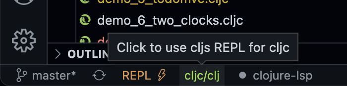

# Using Calva

Easiest way to hack on this project using [Calva](https://calva.io) is to start the REPL and connect it using **Calva Jack-in**

0. Open the project in a VS Code window.
1. Issue the VS Code command: **Calva: Start a Project REPL and Connect (aka Jack-in)**
2. In the **Project type** menu, choose **Electric Starter App**
3. Soon the Calva Output window will print _👉 App server available at http://0.0.0.0:8080_

When editing `.cljc` files, Calva will evaluate forms in the currently connected CLJC REPL. There's a command to toggle it between CLJ and CLJS. You can also use the statusbar `cljc/clj[s]` button to toggle this. 

When having multiple browser tabs open wit the app Calva only sends evaluations to one of the apps. Check with `println` to see which console prints. If you know the shadow-cljs API well, please consider a PR on  [the Calva repository](https://github.com/BetterThanTomorrow/calva) to fix this problem.

See [calva.io](https://calva.io) for more.
